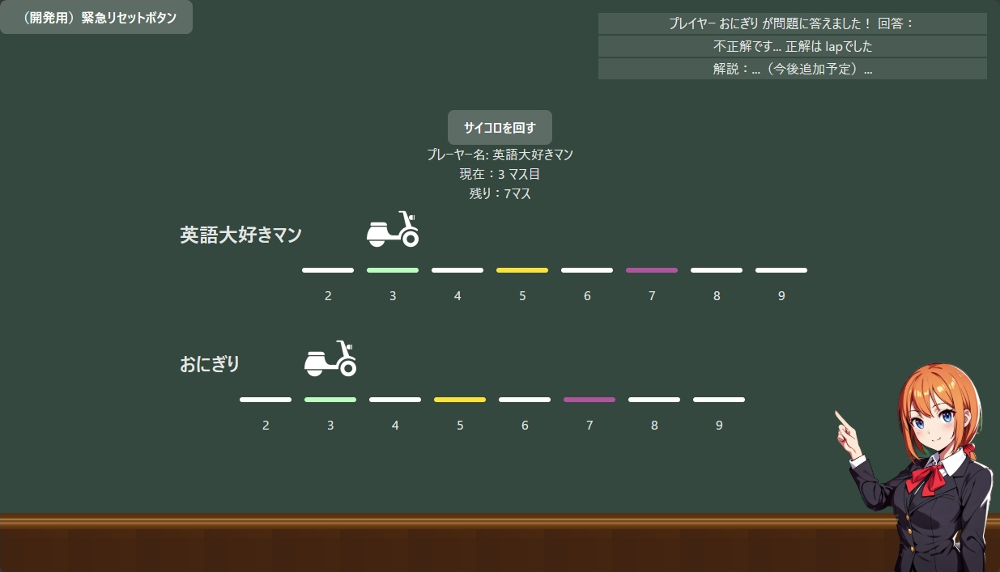
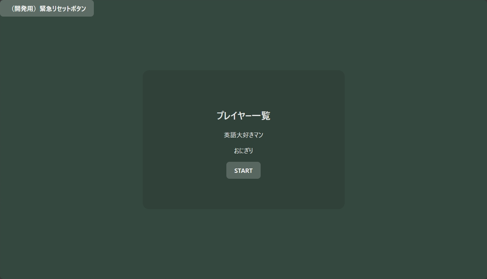
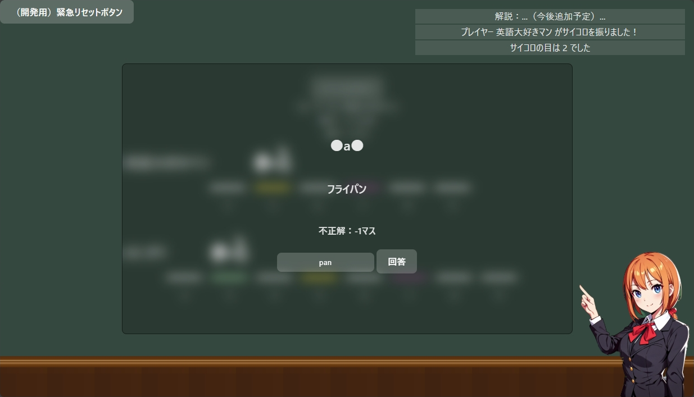
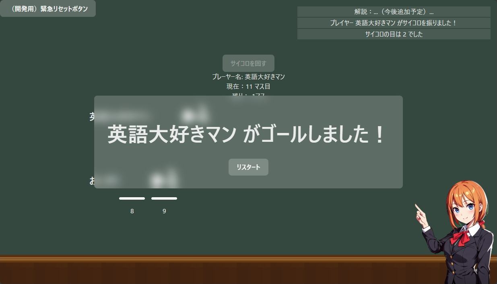

# 英語スゴロク『スゴタン』

『お産ハッカソン』🏆優勝作品 
（2024年8月10日 GMOペパボ鹿児島オフィスにて開催）

チーム　🍹カシオレ 
上村 優介 | 末永哲朗 | 木下誠祥 | 福田啓太 | 宮脇遼雅

<!-- # 開発環境のインストール方法
1. リポジトリのクローン
2. `npm install`でフロントエンド開発用のパッケージをインストール
3. `pip install flask flask-socketio`バックエンドサーバーに必要なパッケージをインストール
4. `npm start`でフロント画面をビルド、バックエンドサーバーを起動する

## クライアントの本番用ビルド
1. ルートディレクトリにおいて、`npm run build`コマンドの実行
2. `dist`フォルダに成果物が出力される -->

## 📝 概要
- スゴロクをしながら英単語を勉強できる、リアルタイム対戦型すごろく+単語帳ゲームです
- マス目に止まる度に英単語クイズが出題されます
- 正解するとより早くゴールに到達できます
- 1位が取れれば成長している証！（かも？）

## 🌟 スゴタンの良さ
- ゲーム形式で楽しく単語を覚えられる（運要素もあるため下剋上も可能、でも知識がある方が有利->勉強を促進）
- 自分以外のプレイヤーに出された問題も見えるため一緒に考えられる（答えを覚えれば後々自分も有利に）
- 将来的には問題セットを変えることで古語や専門用語、など様々なバリエーションも可能

## 🎲 ルール・遊び方
### ゲームへの参加
1. 参加したい人全員でスゴタンが起動しているアドレスにアクセスします（同一PCでもブラウザの別タブで別プレイヤーとして参加できます）
2. 名前を入力して「JOIN」をクリックします
3. 全員揃ったらSTARTを押してゲームを開始します

### ゲームの進め方
- 順番に「サイコロを回す」ボタンを押してランダムに1～6マス進みます
- マス目に止まると問題が出題されます
- イベントマス（色がついているマス）では正解・不正解が進み方に影響します（正解で+1マス、不正解で-1マスなど）
- 先にゴールした人の勝ちです！

### 緊急リセットボタンについて
このゲームはハッカソン向けに短期間で最低限の機能から開発を進めたため、機能不足やバグがある可能性があります

ゲームが進行できなくなったり、正しく動かないなどの場合には左上の「緊急リセットボタン」を押すことでサーバーを再起動してリセットすることができます

## 🔗 デモページ

- [『スゴタン』デモページ](https://sugoroku-demo3.onrender.com/)から試しに遊ぶことができます

プレイしたい人全員に上記のページにアクセスしてもらいましょう

※⏳ホスティングサービスの都合上読み込みに時間がかかる場合があります 
※⚠️ルーム機能が実装されていないため、同時に2つ以上のゲームをホストできません！ 
※⚠️既にゲームが始まっていて参加できない場合には前述の「緊急リセットボタン」を押すことで参加できるようになりますが、既にゲームにいた人たちも最初の画面に戻されてしまいます（上記2つの理由から、ローカルに環境を構築することを強くお勧めします） 

## 🚀 ローカル環境構築
1. [Node.js](https://nodejs.org/ja)、および[Python](https://www.python.org/downloads/)をインストールしておく
2. リポジトリをクローン
3. プロジェクトのルートで、`npm install`を実行してフロントエンドに必要なパッケージをインストール
4. `npm run build`を実行してフロントエンドをビルド
5. Pythonの仮想環境（venv, conda等）を用意し、`pip install -r requirements.txt`を実行してバックエンドに必要なパッケージをインストール
6. `python server/main.py`を実行
7. "<samp>Running on http://（IPアドレス）:（ポート番号）</samp>"というメッセージが表示されたら、IPアドレスの部分をブラウザで開く 
（"<samp>Running on http://192.168.1.100:5555</samp>"と表示された場合は、`http://192.168.1.100`にアクセス）
8. 同一PCで複数人プレイする場合は別タブで上記のアドレスにアクセス 
別PCからアクセスする場合はファイアウォールやポートフォワーディング等を適切に設定

## 🛠️ 技術スタック
### フロントエンド

Svelte + TypeScript
- Svelteにより、ハッカソンで重要視されるスピード感を実現（直感的な記法）
- TypeScriptを使った型安全・IDEによるコード補完の恩恵を受けられるコーディング

### バックエンド

SocketIO + Flask + Python
- SocketIOでクライアント・サーバー間の双方向リアルタイム通信
- 将来的な拡張性を考えPythonを採用（OCRを使った問題文のインポートなど）